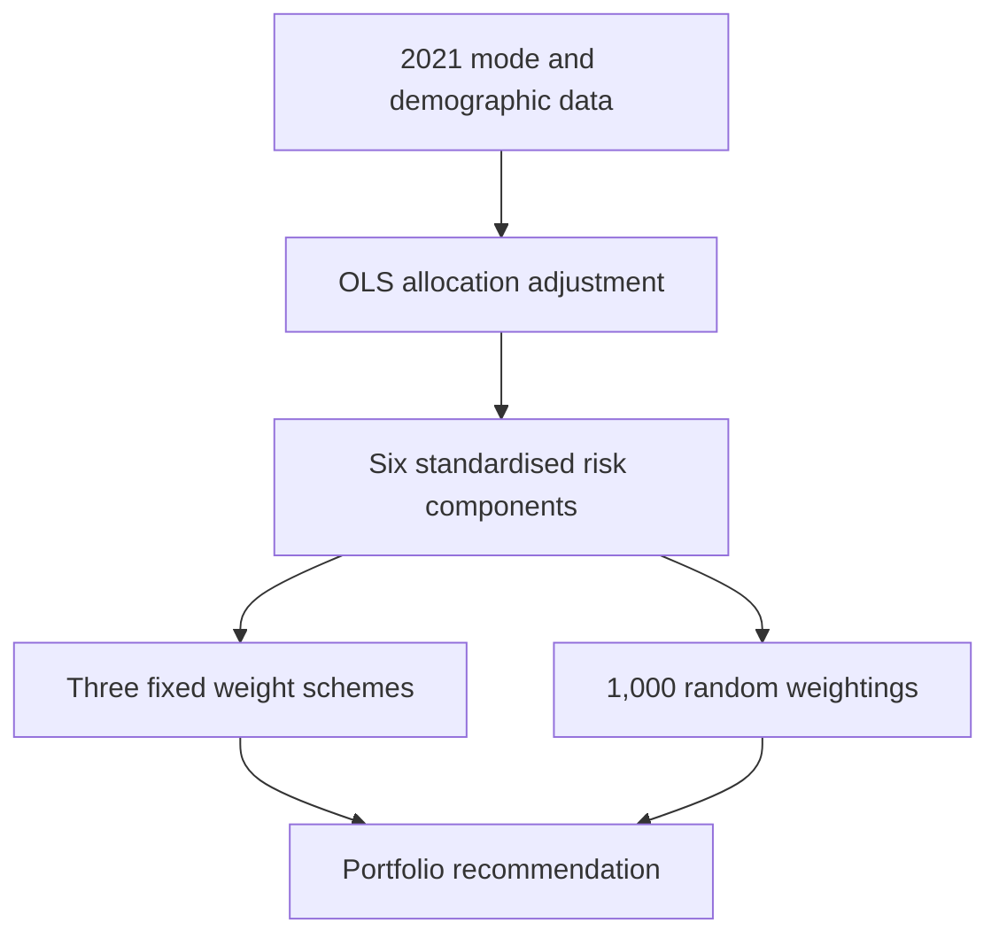
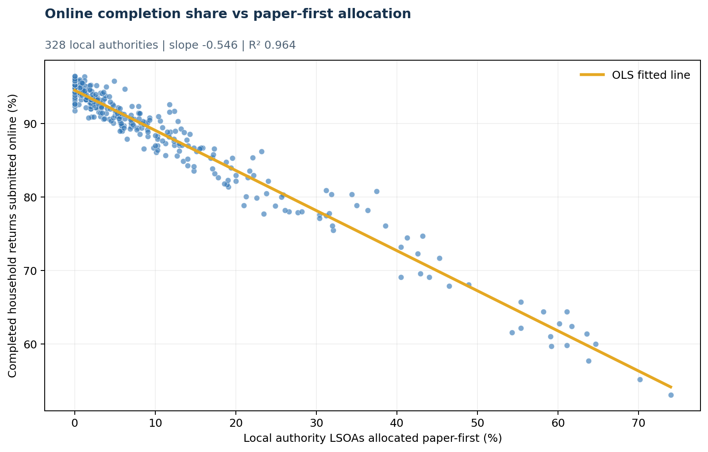
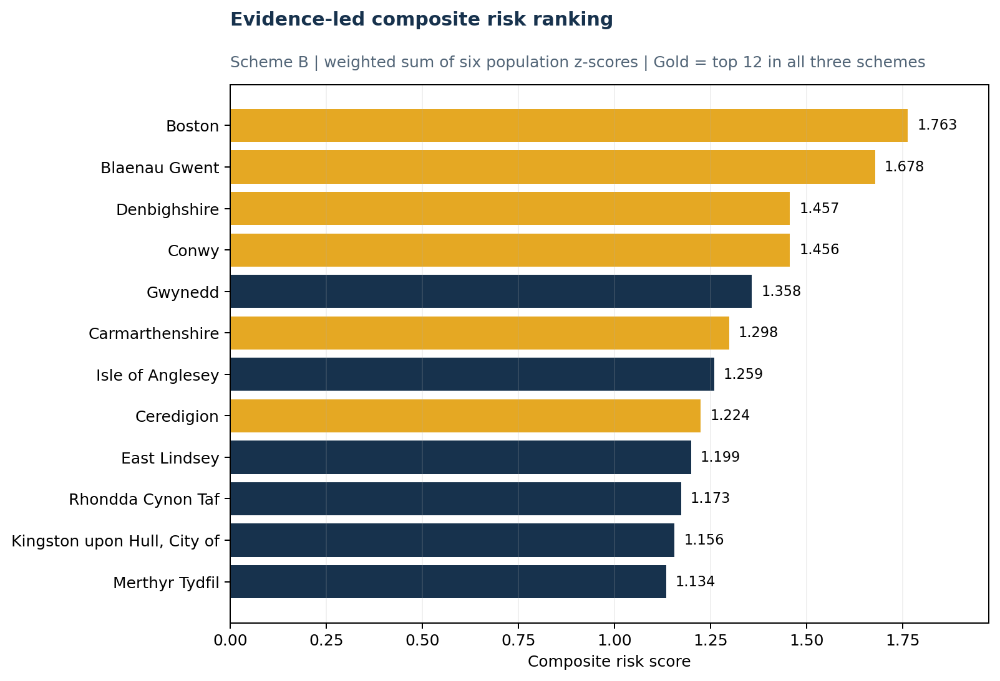
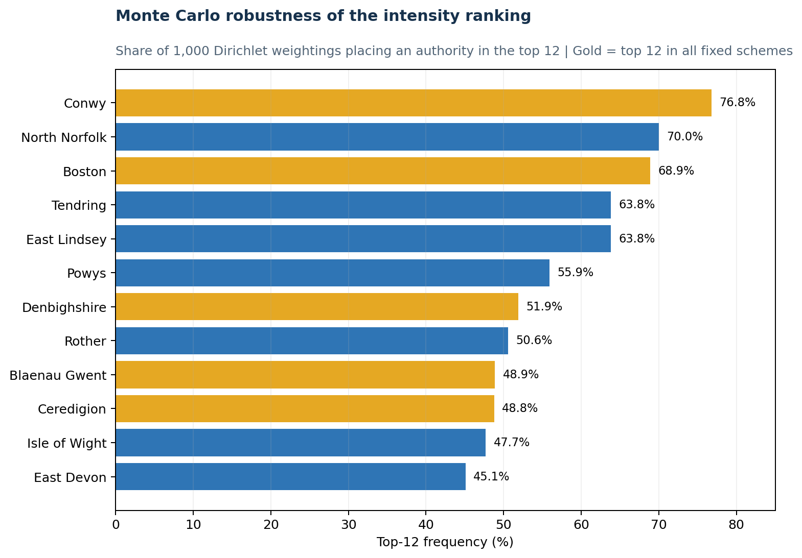

# Census 2031 Digital Inclusion Risk Framework

**A decision-focused Python analysis for prioritising local authorities where a digital-first Census could create the greatest inclusion risk.**

[](https://www.python.org/)
[](LICENSE)
[](https://github.com/Vedant-Au/ons-census-2031-digital-inclusion-risk/actions/workflows/quality.yml)

**Portfolio:** [Accessibility business case](https://github.com/Vedant-Au/accessible-employee-services-business-case) · [Enterprise risk](https://github.com/Vedant-Au/enterprise-risk-management-framework) · [Carbon modelling](https://github.com/Vedant-Au/offshore-wind-carbon-footprint-model) · [Workflow automation](https://github.com/Vedant-Au/vfx-workflow-automation-decision-model)

> Portfolio context: this was an ONS Census 2031 case assigned to an MSc group by Hippo. I served as team lead. The code is a transparent reconstruction created after the original Python files were lost; it is not represented as the original submitted code or as official ONS analysis.

## Recruiter quick scan

| Lens | Evidence |
| --- | --- |
| Leadership | Team lead for the MSc consulting case |
| Business analysis | Decision framing, intervention portfolio and implementation implications |
| Analytics | OLS regression, composite indicators and Monte Carlo sensitivity testing |
| Assurance | Data lineage, reconstruction disclosure, 12 tests and explicit share-with-caveats status |

## Decision and recommendation

**Decision:** where should research, assisted-digital support and alternative-contact interventions be prioritised before a digital-first 2031 Census?

The analysis recommends a **portfolio**, not a single ranking. Five locations from the group report—**Boston, Blaenau Gwent, Kingston upon Hull, Conwy and North Norfolk**—cover different combinations of intensity, population scale and underperformance. This avoids testing the same failure mode repeatedly.

| Finding | Evidence | Decision implication |
| --- | --- | --- |
| Mode allocation dominates the observed outcome | Paper-first allocation explains **96.4%** of variation in online completion across 328 authorities | Do not treat raw online completion as an independent measure of digital exclusion |
| Six authorities are high-risk under all three fixed weighting schemes | Boston, Blaenau Gwent, Denbighshire, Conwy, Carmarthenshire and Ceredigion | Strong candidates for deeper qualitative investigation |
| Sensitivity testing changes the ordering | Conwy appears in the top 12 in **76.8%** of 1,000 reported random weightings | Use rankings as prioritisation evidence, not precise truth |
| First contact is the highest-leverage intervention point | Later form or skills support cannot help residents who never engage | Test automatic fallbacks, trusted messengers and contact-channel resilience first |

## Analytical approach



The framework uses three complementary lenses:

1. **Intensity** — a six-component, z-standardised risk index.
2. **Scale** — the size of the potentially paper-dependent population.
3. **Underperformance** — online completion below the level predicted by the 2021 paper-first allocation.

The underperformance measure is:

`predicted online share − actual online share`

A positive value therefore identifies an authority that completed online less often than its allocation would predict. See [the full methodology](docs/METHODOLOGY.md) for formulas, weights and assumptions.

## Results

### Allocation effect



The independently reproduced OLS model gives an intercept of **94.552**, slope of **−0.546**, **R² = 0.964**, and **n = 328**.

### Evidence-led ranking



| Component | Balanced | Evidence-led | Stress test |
| --- | ---: | ---: | ---: |
| Paper-first area share | 20% | 30% | 15% |
| Aged 65 to 74 | 10% | 10% | 5% |
| Aged 75 and over | 10% | 15% | 10% |
| Deprived on 2+ dimensions | 20% | 20% | 15% |
| Limited English proficiency | 20% | 15% | 15% |
| Underperformance residual | 20% | 10% | 40% |

### Sensitivity to weights



Conwy, North Norfolk and Boston were the most robust top-12 authorities across the reported Dirichlet weightings. Kingston upon Hull entered the final portfolio through the separate **scale** lens rather than the intensity robustness test.

## Skills demonstrated

- Business problem framing and decision-oriented recommendations
- Data cleaning, validation and documented lineage
- OLS regression and residual-based feature engineering
- Composite indicator design and population z-standardisation
- Monte Carlo sensitivity analysis with deterministic random seeds
- Python packaging, 12 automated tests, GitHub Actions and reproducible outputs
- Clear visual and executive communication of uncertainty and limitations

## Explore or reproduce

Start with the [executive brief](docs/EXECUTIVE_BRIEF.md), then open the [analysis notebook](notebooks/01_reference_analysis.ipynb). The notebook is a concise walkthrough; the scripts are the canonical reproducible pipeline.

```bash
python -m venv .venv
source .venv/bin/activate          # Windows: .venv\Scripts\activate
pip install -r requirements.txt
python scripts/reproduce_reference_outputs.py
python -m unittest discover -s tests -v
```

To run the full six-component pipeline after restoring the public raw inputs:

```bash
python scripts/run_full_analysis.py data/raw/ons_la_components.csv
```

## Repository map

```text
notebooks/                 Guided analytical walkthrough
docs/                      Executive brief, methodology, dictionary and QA
data/reference/            Surviving 328-authority derived outputs
data/raw/                  Expected raw-data schema and source guidance
outputs/figures/           Recreated publication-ready figures
outputs/tables/            Recreated decision tables
scripts/                   Reproduction entry points
src/ons_risk_index/        Tested analysis and visualisation package
tests/                     Unit, edge-case and data-quality checks
```

## Limitations and responsible use

The surviving workbook contains final scores, ranks and Monte Carlo frequencies but not all raw demographic component columns. The regression, residuals, ranking intersection and figures are independently reproducible; the exact six-component Monte Carlo result cannot be independently regenerated until the public raw inputs are restored.

Displayed workbook scores are rounded to three decimals while saved ranks reflect higher precision. This creates some adjacent rank ties or swaps without changing the six-authority top-12 intersection. Results are area-level prioritisation signals and must not be used to infer the characteristics of individuals.

The current validation outcome is **share with caveats**. See the [validation report](docs/VALIDATION_REPORT.md), [reconstruction notes](RECONSTRUCTION_NOTES.md), [data dictionary](docs/DATA_DICTIONARY.md), and [data licence notes](DATA_LICENSE.md).

## Official data sources

- [ONS: Census 2021 online share by LSOA](https://www.ons.gov.uk/peoplepopulationandcommunity/householdcharacteristics/homeinternetandsocialmediausage/datasets/census2021onlineshareofhouseholdresponsesbylowerlayersuperoutputareaforenglandandwales)
- [ONS: characteristics by mode of completion](https://www.ons.gov.uk/peoplepopulationandcommunity/householdcharacteristics/homeinternetandsocialmediausage/articles/characteristicsofcensus2021respondentsbymodeofcompletionenglandandwales/2023-10-23)
- [Nomis: Census 2021 bulk downloads](https://www.nomisweb.co.uk/sources/census_2021_bulk)

Code is licensed under [MIT](LICENSE). ONS-derived data are subject to the [Open Government Licence](DATA_LICENSE.md). The submitted report and original workbook are intentionally excluded.
